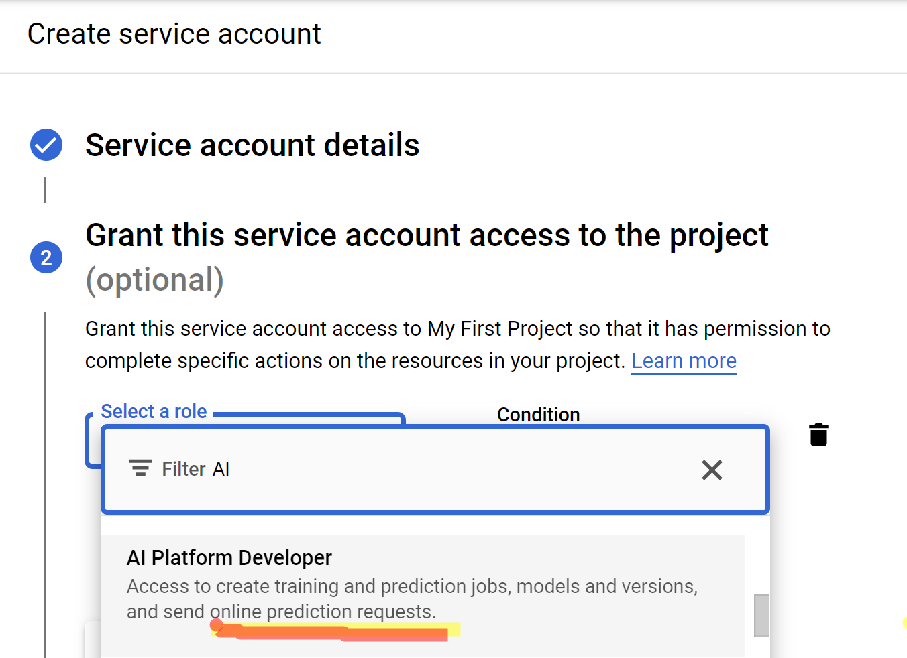
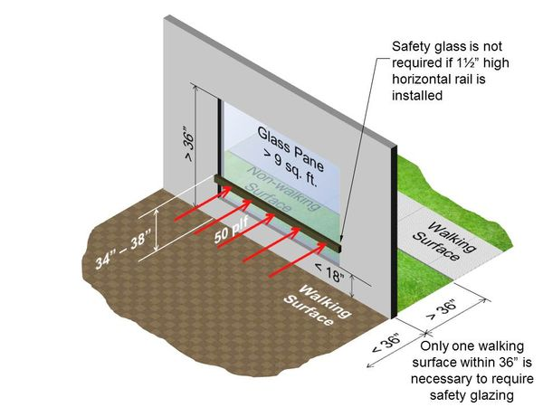

# longjourney
Ghack with Devoteam and Google Cloud

# Possible Future Scenario
We assume that the government announces that individuals or organizations will consume limited energy as a obligation.
# The Goal
While creating a building, everyone need to be more careful about energy comsuption. Because they always comsume the energy for heating a building in winter and cooling a building in the summer. Our application will help them to predict the energy consumption according to features of a building.

# What is the Problem
The problem is to predict the main energy comsumption (heating and cooling) of the building according to their some features.

# Services on Google Cloud Platform
I uploaded my dataset into bigquery because I didn't need to do aything about data preparation, it was already ready to create a ML model.

## 0-) Import the dataset In Bigquery
- Create a dataset under your project. 
- Create a table under your dataset, so you can upload your dataset from your computer to Bigquery.

## 1-) Create a ML Model in Bigquery
- For Healing Consumption Prediction
```
#standardSQL
CREATE OR REPLACE MODEL `energy_efficiency.heating_energy_model`
OPTIONS
  (model_type='linear_reg',
  input_label_cols=['Y1']) AS
SELECT
  X1, X2, X3, X4, X5, X6, X7, X8, Y1
FROM
  `energy_efficiency.energy_consumption`
WHERE
  Y1 IS NOT NULL
```
- For Cooling Consumption Prediction
```
#standardSQL
CREATE OR REPLACE MODEL `energy_efficiency.cooling_energy_model`
OPTIONS
  (model_type='linear_reg',
  input_label_cols=['Y2']) AS
SELECT
  X1, X2, X3, X4, X5, X6, X7, X8, Y2
FROM
  `energy_efficiency.energy_consumption`
WHERE
  Y2 IS NOT NULL
```

## 2-) Save models in Gcloud storage
- In cloud shell
```
bq extract -m energy_efficiency.heating_energy_model gs://ml_models_ghack/heating_model
bq extract -m energy_efficiency.cooling_energy_model gs://ml_models_ghack/cooling_model
```

## 3-) Deploy Models in AI-Platform in GCP for having endpoints, Finally we can use these endpooints to predict new data 
- Deploy Heating Model  in cloud shell
```
MODEL_NAME="HEATING_MODEL_GCP"
gcloud ai-platform models create $MODEL_NAME
MODEL_DIR="gs://ml_models_ghack/heating_model"
VERSION_NAME="v1"
gcloud ai-platform versions create $VERSION_NAME --model=$MODEL_NAME --origin=$MODEL_DIR --python-version=3.7 --runtime-version=2.8 --machine-type="n1-standard-2"
```
- Deploy Cooling Model 
```
MODEL_NAME="COOLING_MODEL_GCP"
gcloud ai-platform models create $MODEL_NAME
MODEL_DIR="gs://ml_models_ghack/cooling_model"
VERSION_NAME="v1"
gcloud ai-platform versions create $VERSION_NAME --model=$MODEL_NAME --origin=$MODEL_DIR --python-version=3.7 --runtime-version=2.8 --machine-type="n1-standard-2"
```

## 4-) Download service account key to access GCP services (AI-PLatform)



## 5-) Sample data for testing ML model in AI-Platform

{"instances": [{'X1': 0.98, 'X2': 514.5, 'X3': 294.0, 'X4': 110.25, 'X5': 7.0, 'X6': 3.0,
                    'X7': 0.0, 'X8': 0.0},
            {'X1': 0.98, 'X2': 514.5, 'X3': 294.0, 'X4': 110.25, 'X5': 7.0, 'X6': 4.0,
                    'X7': 0.0, 'X8': 0.0}]}


## Features of the Building
### **Orientation of the Building** 
Orientation of building is defined as a method of fixing in direction of the plan in such a way that it receives maximum benefit from the elements of nature such as sun, wind, and rain.

### **Glazing Area**


### **Heating Load**
Heat load refers to the amount of heating that a building needs in order to maintain the indoor temperature at established levels.

### **Cooling Load**
The cooling load is the amount of heat energy that would need to be removed from a space (cooling) to maintain the temperature in an acceptable range. 